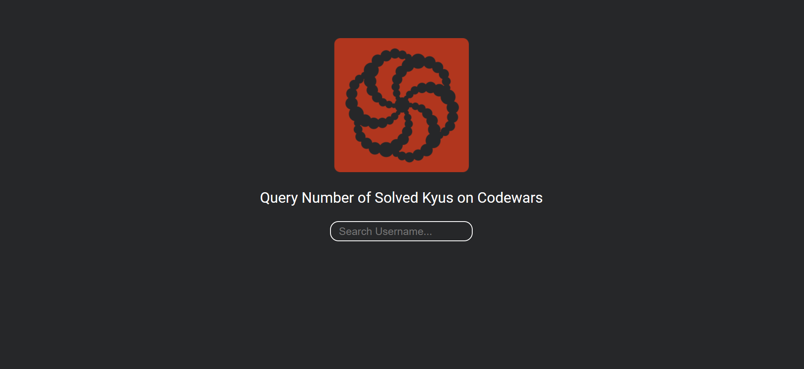
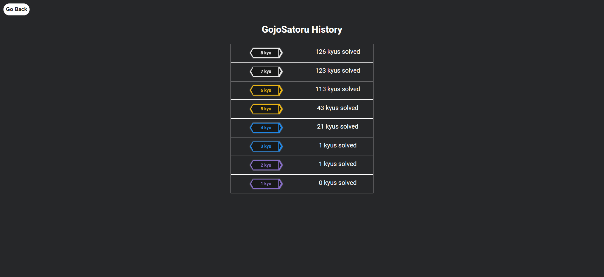

# Codewars Track Solved Kyus

The project helps to track your progress to solving kyus

## Description

The aim of project is that help to Nimble students for tracking number of solved problems kyu by kyu. It will display as a table. The time of query increases to be directly proportional to the number of problems you solve.

### Example calculation 
If number of solved problems is 430, then the query time is almost 215 seconds, so 3 min 30 seconds

## Screenshots
### Home Page

### Result Page

## Getting Started

### Installing

* You don't need any installation.

### Executing program

* You can use the project by going to index.html direction.

## License

This project is licensed under the MIT License - see the LICENSE.md file for details

